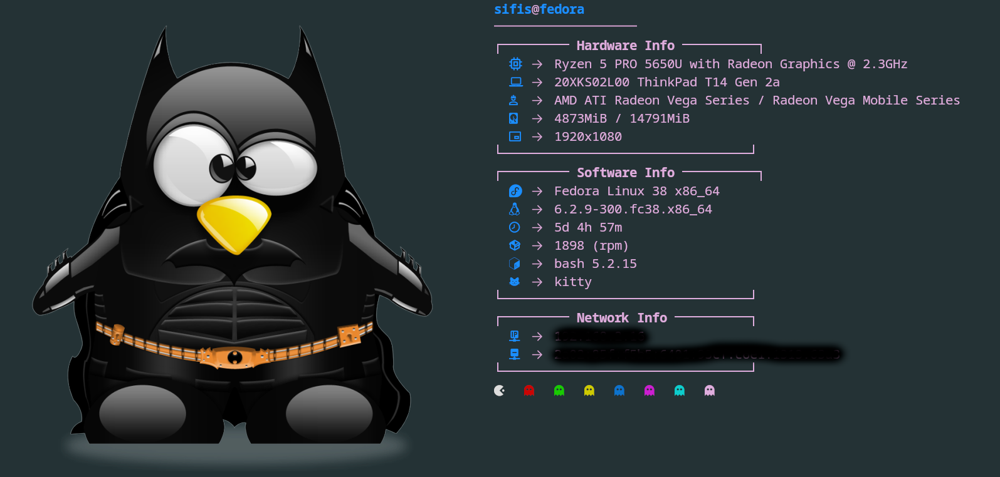

# Files Ssystem Backup

This reposiroty includes some of mine configurations for my **terminal dotfiles** and **.config** directory.

Here you can see the structure for this repository:

   ├── .bash_profile
   ├── .bashrc
   ├── kitty
   │   └── kitty.conf
   ├── LICENSE
   ├── neofetch
   │   ├── config.conf
   │   └── neofetchImages
   │       └── LinuxPengImg
   │           ├── batmanPeg.png
   │           ├── BlueHatPeg.png
   │           ├── DrunkPeg.png
   │           ├── gunPeg.png
   │           ├── ningaPeg.png
   │           ├── phdPeg.png
   │           └── SamuraiPeg.png
   ├── README.md
   └── Screenshots
       └── BatmanNeofetch.png
